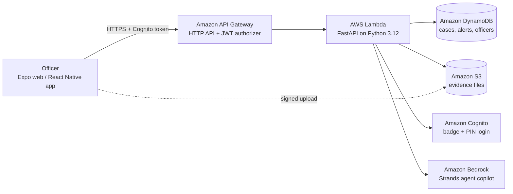

# CrimeSphere AI

**A serverless AWS backend and AI copilot for police duty officers.** Officers sign in with a badge and PIN, see live case data, file FIRs, and ask an AI assistant about cases, all with role-based access enforced on the server.

> **Bharat Builds Tour, Event 01 (WeMakeDevs x AWS)** · Team `6KN2WJ` · Track: **Ship It** (deployed on AWS)

| | |
|---|---|
| Demo video (3 min) | **TODO: paste link** |
| Live app | **TODO: paste link, or run it locally (see [Run it](#run-it))** |
| Blog post (AWS Builder Center) | **TODO: paste link, or delete this row** |

---

## The problem

A duty officer's information is scattered: case files, alerts, complainants, evidence and notes live in different places. Filing an FIR is slow, patterns across cases are easy to miss (for example a chain-snatching cluster around one junction), and any shared system needs strict rules about who can see and change what.

## The solution

CrimeSphere AI puts these in one command-centre interface backed by a fully serverless AWS stack:

- **Sign in with badge + PIN.** Each account has a role (Commissioner, Inspector, Sub-Inspector, Head Constable, Constable).
- **Case Files** load from a cloud database, and officers **register new FIRs**. The server assigns the FIR number and records who filed it.
- **Roles are enforced by the API**, not just by hiding buttons. For example, a Constable cannot file an FIR even if they call the API directly.
- **AI Copilot** (in the Duty Notebook) answers questions like "any chain snatching near Hoodi?" using **read-only tools over the real case data**, and cites case IDs instead of guessing.
- **Evidence uploads** go straight to S3 through short-lived signed links.

## What is connected to AWS today

| Feature | Status |
|---|---|
| Login (Cognito), role from the server | Live on AWS |
| Case list, case detail, search | Live on AWS (DynamoDB) |
| Register FIR (server-assigned FIR number and officer) | Live on AWS |
| Update or delete a case, timeline notes | Live on AWS (API) |
| Dashboard counts on the Control Room | Live on AWS |
| AI Copilot (Duty Notebook) | Live on AWS. Runs a Strands agent on Amazon Bedrock. If no model is configured or Bedrock is unreachable, it answers from the same case data and marks the response `"source": "fallback"` |
| Evidence upload | API and S3 signed uploads are built and tested; the upload button in the app is not connected yet |
| Alerts screen, Crime Map, Crime Tracker, Commissioner admin screens | Still prototype screens on sample data |

## Architecture



| AWS service | What we use it for |
|---|---|
| **API Gateway (HTTP API)** | Public REST endpoint. A JWT authorizer validates the Cognito token before our code runs, and throttling limits abuse and model cost |
| **Lambda** | One function running FastAPI, which keeps the `/api/v1` contract the frontend was already written for |
| **DynamoDB** | Cases, alerts and officer profiles (on-demand billing) |
| **Cognito** | Officer accounts with badge and PIN. The role travels in the token |
| **S3** | Evidence files, private, with signed uploads that enforce a size cap and content type |
| **Bedrock + Strands Agents SDK** | The AI copilot: an agent with four read-only tools (`search_cases`, `get_case`, `list_alerts`, `shift_summary`) |
| **CloudFormation (SAM)** | The whole stack is defined in `backend/template.yaml` and deploys with one command |
| **CloudWatch** | Lambda logs for debugging |

## Design decisions

- **The server is the authority.** FIR ids, FIR numbers and the filing officer come from the server and the token, never from the request body. Permissions (`backend/src/app/rbac.py`) mirror the app's role rules.
- **Token checks happen at API Gateway.** Only `login` and `health` are public. Everything else needs a valid Cognito token.
- **The copilot can only read.** Its tools cannot modify anything, and its instructions treat text inside case files as untrusted data, which limits what a malicious FIR description could do.
- **Graceful degradation.** If the AI model is unavailable, the copilot still answers from real records instead of showing an error.
- **Files skip the server.** Evidence goes directly to S3 via signed uploads, so large videos never pass through Lambda.

## Tech stack

**Frontend:** React Native (Expo, web), TypeScript, Zustand, React Navigation, Axios.
**Backend:** Python 3.12, FastAPI + Mangum, boto3, Strands Agents SDK, AWS SAM.
**Tests:** pytest against local fakes of DynamoDB, S3 and Cognito (moto), so no AWS account is needed to run them.

## Demo accounts

Synthetic data, demo-only credentials. PIN for every account: `1234`.

| Role | Badge number |
|---|---|
| Commissioner | `KSP-COMM-001` |
| Inspector | `KSP-WF-4421` |
| Sub-Inspector | `KSP-SI-1024` |
| Head Constable | `KSP-HC-3012` |
| Constable | `KSP-CONST-5088` |

**Suggested walkthrough**
1. Sign in as the **Inspector**. Open **Case Files** and see the cases loaded from DynamoDB.
2. On the **Control Room**, click **+ New FIR**, submit one, and note the server-assigned number (`FIR KA-CR-1200`). It appears at the top of Case Files.
3. Open **Duty Notebook**, click the **AI** button, and ask *"any chain snatching near Hoodi?"*.
4. Sign in as the **Constable**. The FIR button is gone, and the API refuses the request even if you call it directly.

## Run it

The backend is already deployed, so you only need the frontend.

```bash
git clone https://github.com/JayasriKarthi/Datathon.git
cd Datathon
npm install
cp .env.example .env      # set EXPO_PUBLIC_API_URL to the deployed API URL
npx expo start --web      # then open http://localhost:8081
```

With no `EXPO_PUBLIC_API_URL`, the app falls back to its original offline mock data.

### Deploy your own backend

Needs an AWS account, the AWS CLI and the SAM CLI. Full step-by-step guide: [`docs/aws-backend.md`](docs/aws-backend.md).

```bash
cd backend
python3 -m venv .venv && source .venv/bin/activate
python build_lambda.py
sam deploy --stack-name crimesphere --region ap-south-1 --resolve-s3 --capabilities CAPABILITY_IAM
pip install boto3 && python seed/seed.py --stack-name crimesphere --region ap-south-1
```

The `ApiUrl` in the deploy output goes into `.env` as `EXPO_PUBLIC_API_URL`. To enable the real AI model, pass `--parameter-overrides "BedrockModelId=<model id>" "BedrockRegion=<region>"` to `sam deploy`.

## Repository layout

```
.
├── src/                 Frontend: screens, stores, API client (src/api)
├── backend/
│   ├── template.yaml      AWS infrastructure (SAM)
│   ├── build_lambda.py    Builds the Lambda package without Docker
│   ├── src/app/           FastAPI app: routers, RBAC, DynamoDB layer, Strands agent
│   ├── seed/              Loads demo data and creates officer accounts
│   └── tests/             pytest suite
├── docs/aws-backend.md  Detailed deployment guide
├── .env.example         Frontend configuration template
└── concept_document.md  Original product concept
```

## What we learned

- **CORS with a JWT authorizer.** Browsers send a token-less `OPTIONS` preflight before every call. It must skip the authorizer, and API Gateway does not answer it for you once you define that route, so the function has to return a 2xx.
- **Cognito password rules vs. a 4-digit PIN.** The default policy rejects PIN-style passwords, so we relaxed the policy and derive the Cognito password from PIN and badge.
- **Lambda packaging across operating systems.** Compiled dependencies built on a laptop break on Lambda, so the build script downloads Linux wheels instead of relying on the local platform.
- **Where authority lives.** Anything that decides identity or permissions (FIR numbers, the filing officer, roles, upload limits) has to be decided on the server.
- **Building an agent safely.** Giving the model only read-only tools and treating case text as data, not instructions.

## Limitations and next steps

- Alerts, Crime Map, Crime Tracker and the commissioner admin screens are not connected to the backend yet.
- Wire up the evidence upload button (the API is ready) and add OCR or image analysis on uploaded evidence.
- Replace `Scan`-based search with indexes or Amazon OpenSearch as data grows.
- A 4-digit PIN is a weak credential. A real deployment needs multi-factor authentication.
- All data is synthetic. Do not load real FIR data into a demo environment.

## Team

| Name | WeMakeDevs handle | |
|---|---|---|
| Jayasri K | @jayasrik | Team leader |
| Naresh Kumar | @naresh686 | |
| MOHITH V | @mohith11 | |
| Dhanvanth GS | @dhanvanth | |

## License

See [LICENSE](LICENSE).
